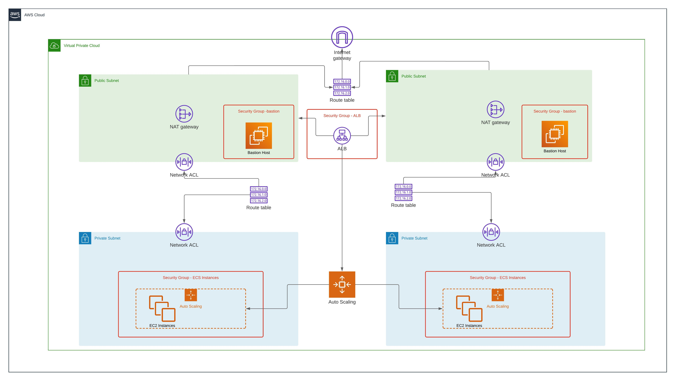

# AWS ECS with Terraform

## Project Overview

This project involves creating a containerized application and deploying it to Amazon Web Services (AWS) using Elastic Container Service (ECS) with Terraform. The application's image is stored in the Elastic Container Registry (ECR), and the service is made highly available by running across multiple Availability Zones (AZs).



## Application Details

- **ECR Repository**: The Docker image of the application is stored in AWS ECR, which is a fully managed Docker container registry that allows developers to store, manage, and deploy Docker container images.

- **Containerized Application**: The application is containerized, meaning it is encapsulated with its dependencies and configuration for consistency across multiple environments. I'll be using the following web app to showcase this project -> https://github.com/m-marcal/imdb-top-100. The latest build can be found here -> https://hub.docker.com/repository/docker/marcelomarcal/imdb-top-100

## Infrastructure

- **ECS Cluster**: Provisioned with EC2 instances spread across at least two distinct Availability Zones for high availability.

- **EC2 Instances**: The cluster contains at least two EC2 instances that serve as the compute resources for running the containerized applications.

- **Task Definition**: A task definition is created to use the Docker image stored in the ECR. It defines the application's container and includes the necessary configurations such as CPU and memory requirements, environment variables, and log configurations.

- **Service and Load Balancer**: The ECS service manages the application's tasks using a load balancer to distribute traffic and ensure the application remains accessible and evenly balanced across the instances.

## How to Use This Repository

1. **Prerequisites**: 

    * Docker CLI
    * AWS CLI (properly authenticated)
    * Terraform 
    * Valid TMIDb API key. You can get one (for free) on their website -> https://developer.themoviedb.org/reference/intro/getting-started

2. **Clone the Repository**: 

     ```bash
    git clone git@github.com:m-marcal/infinet_aws_ecs.git
    ```

3. **Terraform Initialization**: 

    ```bash
    terraform init 
    ```

4. **Deployment**:

    ```bash
    terraform apply # make sure to pass a valid API key from TMDB
    ```

5. **GET ECR URL**

    ```bash
    terraform output # get the ECR Registry URL
    ```

6. **Authenticate using docker cli**

    * ```bash
      aws ecr get-login-password --region us-east-1 | docker login --username AWS --password-stdin {ECR_URL}
        ```
    * Note: It's very important to remove the container name part from terraform output for the command above work properly. For example, from "320033586563.dkr.ecr.us-east-1.amazonaws.com/infnet-imdb-app-registry" we just need **"320033586563.dkr.ecr.us-east-1.amazonaws.com"**

7. **Either tag an existing image that listen on port 5000 or use mine:**

    ```bash
    docker image pull marcelomarcal/imdb-top-100
    docker tag marcelomarcal/imdb-top-100 {ECR_URL}:latest
    docker push {ECR_URL}:latest
    ```

8. **Check if it works (it should, right?)**

    * Make sure to wait a few moments since it takes some time to 
    publish the container tasks
    
    ```bash
    terraform output # get the load balancer dns
    curl http://{ALB_DNS}
    ```
